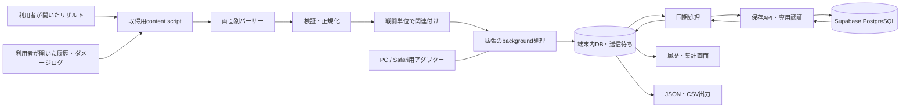

# グラブル ドロップ・火力記録拡張 — 基本設計書

版：0.4  
作成日：2026-10-04（日本時間）  
更新日：2026-10-05（日本時間）  
状態：PC向け初期実装あり・実ゲーム画面未検証  
仮称：GBF Battle & Drop Log  
更新内容：PCを先行実装。GitHubの kaguya25/gubunji を使用。実装範囲と今後の設計を区別

## 1. 目的と結論

グランブルーファンタジーのリザルト・バトル履歴・ダメージログの表示情報から、ドロップアイテムとダメージを読み取り、共通の外部保存先へ保存し、PCとiPhoneで履歴と集計を確認できるブラウザ拡張を作る。キャラクターがどれくらい火力を出したかも、戦闘ごと・同じ条件の複数戦闘で比較できるようにする。

**推奨構成は、PCのChrome拡張とiPhoneのSafari拡張で取得・集計の処理を共通化する方式。** iPhoneでも取得・記録まで行えることを設計目標にする。PCを先行し、リポジトリーは kaguya25/gubunji を使用する。

**共通保存先はSupabase（PostgreSQL＋専用ログイン）を第一候補とする。** DBを正本とし、各端末のIndexedDBは送信待ちデータと閲覧キャッシュを持つ。スプレッドシートにはCSVで出力できるようにし、直接の自動書き出しは必要に応じて追加する。

初期方式は、利用者が通常のプレイで開いた結果画面の表示要素（DOM）を読み取る。戦闘直後の結果でドロップを保存し、同じ戦闘の履歴・ダメージログを開いたら情報を補完する。自動取得は「開いた画面の自動読み取り・保存」を指し、別のゲーム画面を拡張が自動で開くことは前提にしない。

実際にアイテム名、数量、結果識別情報、キャラ別ダメージがDOMから得られるかは、最初の技術検証で判断する。参照記事には取得の事例があるが、現行画面での自動取得はまだ検証していない。

### 1.1 確定している要件

| 項目 | 内容 |
| --- | --- |
| 対象 | グラブルのドロップアイテム |
| 取得方法 | リザルト画面から自動取得（ユーザー回答済み） |
| 火力分析 | ダメージとキャラごとの火力を確認したい（追加要件） |
| 保存先 | スプシやDB等の共通の外部保存先を使いたい。Supabaseを候補として指定 |
| 参考資料 | ユーザー提示のリザルト収集記事を参考にする |
| 作業順 | 設計書を先に作成 |
| iPhone | できれば対応したい |
| リポジトリー | kaguya25/gubunji を使用（2026-10-05指定） |

### 1.2 この設計で置く前提

- PCはWindows＋Chrome、iPhoneはSafariでの利用を第一候補とする。
- iPhoneは閲覧だけでなく自動取得も対象に含める。必要範囲の回答に応じて段階を調整できる。
- 日本語表示を初期対象とし、対象クエストは技術検証時に指定する。特定イベント専用には固定しない。
- 初期版から共通の外部保存を対象にする。同じSupabaseユーザー・同じクラウドプロフィールでPCとiPhoneの履歴を共有する。
- Supabaseは fuwamoko 組織・新規 gubunji・東京・Free プランを予定。既存 nina_Brain の削除は承認を受け完了。新規作成の料金確認は進行中。ゲームの実データ送信は未実施。
- 設計後の実装作業では指定されたGitHubに接続する。ゲームへのログイン・利用者ブラウザーへの拡張導入は未実施。

### 1.3 v0.1 の実装範囲

PC向けChrome MV3、DOM取得候補、端末保存と送信待ち、履歴・ドロップ集計・キャラ別火力表示、Supabase Authと同期、CSV/JSON、診断出力を実装。サンプルと実データは分離する。現在のドロップDOMとダメージログのセレクターは実画面未検証。

v0.1のクラウド保存は gbf_profiles / gbf_observations の2テーブルで観測を不変の履歴として保存し、表示用データは共通のクライアント処理で再構築する。原子的な操作登録とプロフィールごとの変更順序を実装する。以下の設計に含まれる編集・削除競合、正規化された投影テーブル、編成比較、Safari対応は次段階。全体設計の各表・受け入れ条件は、実装済みを示すものではない。具体的な検証結果はリポジトリーの docs/validation.md を参照。

## 2. 利用の流れ

### PC

1. 拡張を導入し、ゲームの対象サイトで読み取りを許可する。初回に本ツール用のログインを行い、共通保存先のプロフィールを選ぶ。
2. 通常どおりプレイし、リザルト画面を開く。
3. 拡張が表示済みのアイテム・数量と、取得できる総ダメージを読み取り、保存する。
4. 拡張メニューで「端末保存済み」「共通保存済み」「未送信」と、読み取りの状態を確認する。オンラインなら自動送信する。
5. キャラ別火力も記録したい場合は、ゲームのバトル履歴・ダメージログ詳細を開く。拡張が同じ戦闘の記録へ追記する。
6. 履歴画面でドロップ集計とキャラ別火力を見る。

正常に読み取れた結果は保存ボタンを押さずに記録する。確認が必要な結果だけ、後から修正できる。

### iPhone

1. Safari拡張を含むアプリを導入し、Safariで拡張と対象サイトへのアクセスを有効にする。PCと同じ本ツール用アカウント・クラウドプロフィールでログインする。
2. **Safariで**グラブルを開き、通常どおりプレイする。
3. リザルト表示中に取得・保存する。ダメージログ詳細を開いた場合はキャラ別火力も補完する。履歴画面は片手で操作できる幅に対応する。

この構成が直接対象にするのはSafari。SkyLeap、iPhoneのChrome、グラブルのアプリ内画面への組み込みは、このSafari拡張の対応には含めない。利用ブラウザが違う場合は、実装前に対応方法を別途確認する。

## 3. 対応範囲と優先度

| 優先度 | 機能 | 初期仕様 |
| --- | --- | --- |
| 必須 | 自動取得 | 対応済みリザルトから表示中のアイテム・数量を取得 |
| 必須 | 保存状態 | 保存完了、途中、未対応、保存失敗を区別 |
| 必須 | 重複処理 | 同じ結果の再表示・再送を二重計上しない |
| 必須 | 履歴 | 日時、クエスト、アイテム、数量、取得状態を表示 |
| 必須 | 集計 | アイテム合計、取得を確認した結果数、結果あたり平均 |
| 追加要件 | 総ダメージ | 自分のパーティーの総ダメージを取得。ゲーム全体の敵HPや他参加者のダメージと区別 |
| 追加要件 | キャラ別火力 | 主人公・キャラ別の総ダメージ、割合、取得できる内訳を表示 |
| 追加要件 | 火力比較 | 同じクエスト・条件の記録で平均、中央値、最大、サンプル数を表示 |
| 必須 | 未知アイテム | 読み取った情報を保留し、既知アイテムに決めつけない |
| 必須 | データ移動 | JSONバックアップ・復元、CSV出力 |
| 必須 | 修正・除外 | 原記録を残したまま訂正、集計からの除外、取り消し |
| 必須 | 共通保存 | 取得したドロップ・戦闘・火力データをSupabaseへ自動保存 |
| 必須 | 端末間同期 | PCとiPhoneで同じプロフィールの記録を取得・閲覧 |
| 必須 | 送信待ち保存 | 通信失敗時に端末内へ保持し、同じ送信IDで再試行 |
| 次段階 | iPhone自動取得 | 共通処理をSafari拡張として導入・実機検証 |
| 次段階 | 目標数 | 欲しいアイテムの累計と目標までの残数 |
| 任意 | ターンごとの分析 | 元データを取得できる場合に限り追加。最終合計からターン推移を作らない |
| 任意 | スプシへの自動出力 | DBから選択したシートへ書き出す。初期版はCSV出力 |
| 任意 | 画像取り込み | 未対応画面の補助。自動取得の代替として黙って切り替えない |

ここでいう取得は「ゲームで得たアイテムの記録」。ゲーム操作、周回操作、所持品やサーバー応答の変更は対象外とする。初期版はゲームAPIへの追加リクエストや通信の差し替えも行わない。

ブラウザ版グラブル本体の現行利用規約と、この読み取り方式の適合は未確認。読み取り専用であることを、運営の許可やアカウントへの影響がないことの根拠にはしない。別作品の規約を本体の規約として扱わない。

## 4. 取得方式の比較

| 方式 | 自動取得 | iPhoneへの展開 | 判断 |
| --- | --- | --- | --- |
| リザルトDOMの読み取り | 表示情報があれば可能 | Safari拡張へ共通化できる | **第一候補**。実画面で成立するか検証 |
| リザルト画像の認識 | 画像取得と認識の検証が必要 | 画像取り込みの補助として検討できる | 数量・類似アイコンの誤認識があるため後回し |
| 通信内容・ゲーム内部状態の解析 | 表示以外の情報に依存する | ブラウザ間の差が増える | 初期方式には採用しない |
| 手動入力 | 自動取得を満たさない | 対応しやすい | 訂正・未取得分の補助のみ |
| 独立したWebアプリ／PWA | 別タブのゲーム画面を直接読めない | 閲覧・ファイル取り込みに使える | 管理画面の追加候補。単体では自動取得を満たさない |

Chromeのcontent scriptはページのDOMを読み取れる独立した実行環境を持つ。この方式を基本にし、ゲーム側のJavaScript関数を置き換えずに取得処理を組む。[Chromeのcontent scripts資料](https://developer.chrome.com/docs/extensions/develop/concepts/content-scripts)

### 4.1 参照記事から取り込む取得候補

2025-01-17公開の[リザルト収集の記事](https://kamuiz.livedoor.blog/archives/27813066.html)は、HTML読み取りの実例と調査の手掛かりとして使う。記事にある次の情報を、現行画面で検証する候補にする。

| 取得候補 | 設計への反映 |
| --- | --- |
| `#result_multi/<ID>`と`#result_multi/detail/<ID>/...` | 直後の結果と詳細履歴を別パーサーで読み、共通IDを検証して関連付ける |
| `#result` | 通常の結果を表示した時点で保存するパーサーを用意 |
| `.prt-item-list`、`data-key`、item-kind／item-id | アイテム種類とIDを組にして照合する候補 |
| databox、`.prt-article-count` | 報酬区分と数量の候補。省略表記はサンプルで検証 |

記事の箱順序の解析には通信JSONとプロキシも登場する。今回の初期版は結果とダメージログのDOMで成立する範囲を先に検証する。リザルトの配置から箱番号を断定せず、キャラ別ダメージの取得を、通信解析なしで成立させられるか確認する。

この記事は現行仕様や規約適合の保証には使わない。具体的なセレクターやルートは候補であり、2026年の実画面で一致するかは未確認。

## 5. 最初に行う実現性検証

実装に進む場合は、全機能の開発より先に次の短い検証を行う。

1. 指定された通常クエスト／マルチバトルの直後の結果、詳細履歴、ダメージログを確認する。ソロなど画面が異なるものは別に判定する。
2. 結果画面の判定、アイテム名・数量、クエスト名、戦闘を識別する情報、総ダメージの取得可否を調べる。記事のDOM候補を照合する。
3. アイコンだけの項目、遅延表示、複数の報酬欄、折り畳み欄、スクロールによる追加表示を確認する。
4. 同じ結果を再表示した場合と、別の戦闘で同じアイテムが出た場合を区別できるか確認する。
5. 主人公・キャラ別の総ダメージ、攻撃種別の内訳、自己ターン数、経過時間を読めるか調べる。折り畳み・表示カテゴリ切り替えで初めて現れる項目は区別する。
6. 直後の結果と後から開いた履歴・ダメージログを、同じ戦闘として関連付けられるか確認する。
7. Safariでも同じ読み取りが成立するか実機で確認する。

| 判定 | 条件 | 次の作業 |
| --- | --- | --- |
| 成立 | 対応画面で対象項目と戦闘の関連付けを安定して読める | 自動保存・火力分析の実装へ進む |
| 部分成立 | ドロップ、総ダメージ、キャラ別、内訳の一部だけ読める | 機能ごとに対応範囲を明示。読めない項目は未取得 |
| 不成立 | 必要項目が画像内にしかない等、DOM方式で取得できない | 該当機能の方式を再検討し、変更点を説明する |

候補となるセレクターや識別子は、検証前に確定仕様として固定しない。技術検証の結果と、対応する画面サンプルを後から設計書へ追記する。ドロップの取得が成立しても、キャラ別火力が成立したことにはしない。

## 6. システム構成



### 6.1 共通にする部分

- 取得候補のデータ型、数量・ダメージの検証、アイテム・キャラの照合。
- 戦闘の関連付け、重複判定、訂正履歴、ドロップと火力の集計、JSON・CSV形式。
- 送信待ちキュー、送信ID、差分取得とキャッシュ更新。クラウド保存アダプターを取得処理から分離する。
- 画面パーサー。PCとiPhoneで構造が違う箇所は別プロファイルに分ける。
- 履歴・集計画面のUI。端末の幅に応じて配置を変える。

### 6.2 端末別に分ける部分

- manifest、権限設定、拡張メニューの開き方。
- backgroundの起動・再起動、保存処理の互換性。
- ファイル保存・共有・取り込み。
- Safari用のパッケージ化と配布。

技術候補はTypeScript＋WebExtensions Manifest V3、管理画面はHTML/CSSと軽量なUI構成とする。ビルド環境はリポジトリー接続時に既存構成があればそれに合わせる。将来の独立した管理アプリも同じ集計処理を使えるよう、取得と表示を分離する。

## 7. 画面読み取りの設計

### 7.1 検出と監視

- 拡張起動時に一度、現在の画面を判定する。導入後に既に開いていたリザルトも対象にする。
- `MutationObserver`で結果領域の追加・変更を監視し、更新をまとめて再解析する。
- URLのhash変更や履歴移動、戻る・進む、ページ再表示に対応する。URL変化だけに依存しない。
- 結果領域ができるまでは最小限の監視を行い、見つかったら監視範囲を絞る。
- DOM更新を受けて読む方式を基本とし、短い間隔でページ全体を走査し続けない。

一定時間変化がないだけでは「全報酬がそろった」とは判断しない。画面ごとの読み込み完了、必要欄の存在、追加表示の有無を組み合わせる。完了を確認できなければ部分取得として扱う。

### 7.2 項目の読み取り

| 項目 | 優先する取得元 | 不明時 |
| --- | --- | --- |
| アイテム名 | 表示テキスト、意味のあるalt/title等 | 未分類として保留 |
| アイテム識別子 | DOMに含まれる識別情報、検証済みアイコン対応表 | ローカルの暫定キーを付与 |
| 数量 | 表示数量と、その画面で確認した表記規則 | `null`。一律に1へ置換しない |
| クエスト | 結果画面の見出し等 | 不明クエストとして保存 |
| 報酬区分・箱種 | 明示された表示・検証済みの構造 | 不明。色だけで推定しない |
| 結果識別情報 | 画面・表示先の識別子が得られる場合のみ | 弱い照合へ切り替え、確定扱いしない |
| 総ダメージ | 自分のダメージと確認できる結果・履歴の表示 | 未取得。敵HPや貢献度で代用しない |
| キャラ別ダメージ | ダメージログ詳細のキャラ行・表示カテゴリ | 未取得。総ダメージを均等配分しない |

ゲームのアイテムIDが得られるとは限らない。独自の内部IDとゲーム側のIDを区別する。種類とIDの両方が読める場合は`itemKind:itemId`をゲーム側の照合キーにし、ID単独で別種類のアイテムを統合しない。アイコン対応表は端末表示で確認したものだけ登録し、画像のURLから余分なクエリ情報を保存しない。

### 7.3 表示範囲と部分取得

- 未展開・画面未表示の報酬を、取得済みとみなさない。
- 利用者が報酬欄を開いた場合、同じ結果の記録を更新する。
- 拡張がゲームのボタンを押して報酬欄を展開する仕様にはしない。
- DOMに全報酬が存在する画面は、検証済みの構造に従って全体を読める。画面外の情報が得られるかは別途検証する。
- 表示が分割された報酬は、行の位置・報酬区分を維持する。画面全体から同じアイコンを無差別に足し合わせない。

### 7.4 ダメージログの取得

ドロップ用パーサーとは別に、総ダメージ・キャラ別・内訳を読むパーサーを持つ。結果画面とダメージログが別画面でも、検証済みの戦闘IDで同じ記録に関連付ける。

| 項目 | 保存と扱い |
| --- | --- |
| 自分の総ダメージ | ゲームの表示値を保存。自分／全参加者などの範囲も保持 |
| 主人公 | キャラと別種の行として保存。ジョブが読めれば併記 |
| キャラ別総ダメージ | 表示行ごとに保存。キャラ識別子・バージョン・表示枠を保持 |
| 通常攻撃・カウンター | 内訳カテゴリ候補。元画面が一緒なら、分離して推測しない |
| アビリティ、奥義、その他 | 内訳カテゴリ候補。実画面の分類名と対応付けを保持 |
| ターン数、使用回数 | 表示・意味を確認できた場合だけ保存 |
| 時間 | 値だけでなく、何を開始／終了とする時間かも保存 |

この分類は分析画面の設計候補。現行の公式ダメージログで提供されるカテゴリとDOM構造は未検証であり、ゲームの表示に合わせて確定する。

すべての内訳がDOMに存在すればまとめて読み取る。カテゴリ切り替え・折り畳みを開いた時に初めて値が取得できる場合は、利用者が表示したカテゴリを順次補完し、未取得カテゴリを0にしない。初期版はゲームの詳細画面への自動移動や、自動でのカテゴリ操作を行わない。

### 7.5 キャラの識別とダメージの帰属

- キャラ名だけで集約しない。同名の属性違い・別バージョンは識別子が確認できれば分ける。
- 同じ戦闘の行は、画面プロファイル＋ユニット識別子／枠情報で識別する。行の並び替えを新しいキャラの出場と誤認しない。
- サブからの登場、入れ替え、戦闘不能を想定する。出場時間・行動ターンが分からなければ「出場ターンあたり」の指標を作らない。
- 召喚やチェインバースト等、キャラへの帰属が表示されていないダメージを特定のキャラへ配分しない。
- ダメージの計上先はゲームの表示に従う。支援効果で味方の火力を上げた価値まで、直接ダメージだけで評価したとは扱わない。

### 7.6 完全・部分・未取得の区別

ドロップ取得状態とダメージ取得状態を独立させる。ダメージは「総ダメージ」「キャラ別一覧」「キャラごとの内訳」でも完全性を分ける。キャラ別総ダメージだけ取れた結果で、内訳まで取得済みとは表示しない。

同じ範囲の総ダメージとキャラ合計を検証する。キャラ合計が総値以下で、同じ範囲の差分と確認できる場合だけ未帰属分を保持する。キャラ合計が総値を超える、または範囲が不明なら要確認にし、負の未帰属ダメージを作らない。差の理由が不明な値を、補完計算で既知カテゴリへ割り当てない。取得失敗・該当画面なし・明示された0ダメージを別の状態として保存する。

## 8. 保存状態と重複判定

### 8.1 保存状態

```text
結果候補を検出 → 取得途中として保存 → 完了条件を検証
                                   ├ 完全・識別可能 → 確定記録
                                   ├ 不明項目あり   → 要確認記録
                                   └ 一部のみ       → 部分記録

保存失敗 → 失敗を表示 → 画面が有効な間に同じIDで再送
```

取得範囲、アイテム解決、数量解決、ダメージ取得、重複判定、クラウド同期を別々の状態として持つ。一つの「成功」だけで表現しない。端末内への書き込み完了で「端末保存済み」、サーバーの保存完了を確認して「共通保存済み」と表示する。火力情報が未取得でも、確定したドロップは保存・集計できる。

### 8.2 重複判定の原則

**同じアイテムが同じ数量で出たことだけでは、同じ戦闘とは判断しない。**

1. 安定した戦闘識別情報が得られる場合は、ローカルプロフィール・対象サイト・戦闘種別・戦闘IDから戦闘キーを作る。直後の結果・詳細履歴・ダメージログのURL差を別戦闘のキーにせず、同じ戦闘記録を補完する。IDの対応関係は実画面で検証する。
2. 同じ画面を監視中は取得単位のIDを維持する。遅延表示や再解析は新しい周回として追加しない。
3. 結果が切り替わったことを確認できたら新しい取得単位を作る。ドロップ内容が同じでも別の結果は残す。
4. 安定した識別情報がない状態でリロード・複数タブ・別端末の照合が必要になった場合、類似内容と時刻は「重複の可能性」の判定にのみ使う。自動削除・自動統合はしない。
5. 重複の可能性が解消されていない記録は確定集計から分け、利用者が「別の結果」または「既存記録に統合」を選べるようにする。

background処理は、同じ取得単位ID・同じ更新番号の再送を繰り返し受けても一度だけ適用する。強い一意キーがある場合はDBの一意制約とトランザクションで複数タブの同時保存を扱う。

JSON再取り込みも、既存の記録IDが同じなら増やさない。別端末の独立した記録を内容の一致だけで統合しない。

### 8.3 複数画面からの補完

- 一つの戦闘記録の下に、画面別の取得スナップショットを保持する。後から総ダメージや内訳が取れたら必要な項目を更新する。
- 同じ報酬・同じダメージの別表示は、二つのスナップショットとして保持できるが、集計では一度だけ採用する。各画面の合計を足さない。
- 報酬区分が別であると確認できたものは区分を保持する。既存報酬の再表示と、別の追加報酬を混同しない。
- 優先する値は、検証済みの取得元・同じ範囲・完全性で判断する。後から来た部分取得や`null`で既存の確定値を上書きしない。
- 同じ戦闘・同じ指標で値が食い違ったら、原値と取得元を両方残し、該当指標を要確認にする。値を平均して取り繕わない。
- 戦闘キーが一致しない、または関連付けが弱い場合は自動統合せず、未関連付けの記録として残す。

## 9. データモデル

バックアップ形式の初期版を`schemaVersion: 1`とする。以下は型の例であり、実ゲームの取得結果ではない。

```json
{
  "schemaVersion": 1,
  "records": [
    {
      "recordId": "local-uuid",
      "profileId": "default-local-profile",
      "captureId": "capture-uuid",
      "revision": 1,
      "battleKey": null,
      "resultKey": null,
      "observedAt": "2026-10-04T14:00:00.000Z",
      "platform": "chrome",
      "quest": { "key": null, "name": "サンプルクエスト" },
      "battle": { "id": null, "kind": "unknown", "endedAt": null },
      "setupTag": null,
      "source": { "method": "dom", "parserVersion": "0.2.0" },
      "quality": {
        "coverage": "partial",
        "identity": "unverified",
        "itemResolution": "resolved",
        "quantityResolution": "resolved",
        "deduplication": "clear"
      },
      "drops": [
        {
          "lineId": "reward-section-1-row-1",
          "itemKey": "local-item-key",
          "itemKind": null,
          "itemId": null,
          "name": "サンプル素材",
          "quantity": 3,
          "rewardSection": null,
          "evidence": { "label": "サンプル素材", "quantityText": "3" }
        }
      ],
      "damage": {
        "reportedTotalDamage": null,
        "scope": "unknown",
        "playerTurns": null,
        "elapsedSeconds": null,
        "elapsedDefinition": null,
        "quality": {
          "total": "not_collected",
          "actors": "not_collected",
          "breakdown": "not_collected"
        },
        "actors": [],
        "nonCharacterDamage": null
      },
      "excluded": false
    }
  ]
}
```

- `recordId`は端末で発行するID。`battleKey`は検証済みの強い戦闘識別がある場合だけ設定する。`resultKey`は必要に応じて報酬区分を識別するキーとし、画面URL全体をそのまま一意キーにしない。
- 日時はUTCで保存し、表示と日別集計は利用者が選んだタイムゾーンで統一する。初期表示は端末設定。
- 数量は検証済みの非負整数、または`null`。明示的な報酬なしは`drops: []`＋完全取得で表す。
- アイテムが不明なら`itemKey`を未分類キーとし、既知アイテム名を捏造しない。
- 読み取り根拠はアイテム・ダメージ部分の最小限の文字列・識別情報のみ。ページ全体のHTML、Cookie、認証情報、ユーザー名は保存しない。
- 訂正は原取得とは別に、記録ID・訂正日時・変更内容を持つ。集計は原記録に訂正を適用した値を使用する。
- 集計用キャッシュはいつでも原記録から再生成できるようにし、唯一の保存データにはしない。
- プロフィールは利用者が付けるローカル区分。ゲームのログイン情報を使ってアカウントを判定しない。複数アカウント対応は次段階。
- `quality`はドロップの状態、`damage.quality`は火力の状態。ドロップ完全・火力未取得のような組み合わせを保持する。
- `setupTag`は任意の編成タグ。毎戦入力を求めず、一度選んだタグを後続の記録へ適用する。編成の自動識別ができる場合も、取得した情報の範囲を明記する。
- `endedAt`はゲームに表示された終了日時が得られる場合のみ。後日履歴を開いた日時は`observedAt`として分ける。
- 上記は記録・バックアップ用の型。クラウドへの送信は、後述の送信IDと取得スナップショットを持つ別の通信形式にする。ログイン情報をバックアップに含めない。
- 端末の`recordId`とサーバーの正本IDの対応を保存する。別端末で同じ戦闘を取得した場合、ローカルIDが異なっても検証済み戦闘キーで同じ正本へ関連付ける。

### 9.1 キャラ別ダメージ行の例

以下も実取得データではない。取得済みのキャラ別総ダメージと、未取得の内訳を同じ行に表せる。

```json
{
  "actorRowId": "actor-row-local-id",
  "actorType": "character",
  "characterKey": null,
  "name": "サンプルキャラA",
  "variant": null,
  "unitId": null,
  "slot": null,
  "totalDamage": 12000000,
  "breakdown": {
    "normalAndCounter": null,
    "ability": null,
    "ougi": null,
    "other": null
  },
  "activeTurns": null,
  "actionCounts": null,
  "evidence": {
    "sourceView": "damage_log",
    "displayCategory": "total",
    "parserVersion": "0.2.0",
    "totalDamageText": "12,000,000"
  }
}
```

数値は検証済みの非負整数または`null`。非数値、負数、安全に扱えない桁数は要確認にする。`null`と表示上の0を区別する。カテゴリ名とキャラ行の対応は、各取得元スナップショットに残す。

## 10. 共通保存・同期・バックアップ

### 10.1 保存先の役割

| 保存先 | 役割 |
| --- | --- |
| **Supabase PostgreSQL** | ドロップ、戦闘、キャラ別ダメージ、取得根拠、訂正の正本。PCとiPhoneで共有 |
| 各端末の拡張専用IndexedDB | 未送信の記録、送信結果、履歴キャッシュ。オフラインでも取得を保持 |
| JSONファイル | 記録・状態・訂正のバックアップと復元 |
| CSV／Googleスプレッドシート | 集計・持ち出し用。初期版はCSVを書き出してスプシに取り込める形式 |

Supabaseは保存先の第一候補として設計する。DB・認証・接続先の設定は、指定されたプロジェクトに対して後で行う。プロジェクトを選択・作成したことや、保存できたことは現時点では確認していない。

Googleスプレッドシートを直接の正本にする方式も可能だが、今回は複数画面からの補完、重複判定、キャラ別明細、訂正履歴をDB側で扱う。GASを使う場合は実行上限と同時更新も設計する必要がある。[Googleの実行上限資料](https://developers.google.com/apps-script/guides/services/quotas)

### 10.2 Supabaseの認証とアクセス

- 本ツール専用のSupabase Authでログインする。最初はメール＋パスワードを候補とし、PCとSafari拡張でログイン・更新・再開を検証する。ゲームのログイン情報を流用しない。
- 両端末で同じユーザーと同じクラウドプロフィールを使う。端末ごとに別の匿名ユーザーを発行して共有したつもりにはしない。
- 公開APIに接続するクライアントはpublishable keyとユーザーの認証セッションを使う。secret／service_roleキー、DB接続パスワードを拡張・配布ファイル・Gitへ入れない。
- 利用者データのテーブルにはRLSを適用する。匿名アクセスは許可せず、認証された所有者だけが自分の記録を読み書きできる条件にする。書き込み時も所有者を検証する。
- 子テーブルは、親の戦闘・プロフィールと所有者が一致するよう制約を持つ。送信本文の`ownerId`や任意のプロフィールIDを権限の根拠にしない。
- 訂正に必要なSELECT／UPDATEのポリシーをそろえる。集計ビューを公開する場合も呼び出し元の権限を適用し、RLSを迂回するビューにしない。
- 保存APIは認証を検証し、利用者の権限で処理する。DB関数を使う場合は原則security invokerとし、実行権限を認証ユーザーに限定する。
- 認証セッションは拡張の信頼された画面・background側で扱い、ゲームページへ渡さない。パスワードは保存せず、トークンをエクスポートしない。Safariでの永続化方法は実機検証する。

APIキーと利用者の認証は別の役割を持つ。公開可能なキーだけで、所有者別のデータ保護が成立したとはしない。[SupabaseのAPIキー資料](https://supabase.com/docs/guides/getting-started/api-keys)、[RLS資料](https://supabase.com/docs/guides/database/postgres/row-level-security)、[認証資料](https://supabase.com/docs/guides/auth/passwords)

### 10.3 DBの保存単位

以下はテーブル候補であり、SQLやマイグレーションを作成・適用したものではない。

| テーブル候補 | 主な内容 |
| --- | --- |
| `game_profiles` | 所有者、クラウドプロフィールID、利用者が付けた区分名 |
| `battles` | 正本ID、所有者、プロフィール、検証済み戦闘キー、クエスト、結果状態、サーバー更新番号 |
| `battle_observations` | 画面別の取得スナップショット、取得単位ID、端末ID、解析版、根拠、完全性 |
| `drop_rows` | 戦闘・報酬区分・アイテム種類／ID・数量の明細 |
| `actor_damage_rows` | 戦闘・キャラ行・識別子・総ダメージ・取得済みの内訳 |
| `record_edits` | 訂正・除外・削除・復元の履歴と、対象の更新番号 |
| `sync_operations` | 送信ID、内容ハッシュ、処理結果、対応する正本ID |
| `sync_changes` | 所有者別の変更履歴と、端末へ返す差分カーソル |

安定した戦闘キーがある記録は、所有者＋クラウドプロフィール＋戦闘キーで一意にする。戦闘キーなしの別結果をまとめない。送信IDは所有者内で一意にし、同じ送信を再実行しても同じ結果を返す。

数量・ダメージは非負の整数または`null`とし、DBでも型・参照・一意性を検証する。履歴は所有者・プロフィール・日時・IDで絞り込める索引を持ち、大量の履歴を一度に全取得せずページ分割する。

正本IDが異なる端末内記録を関連付けた場合は、対応表を端末へ返す。以降のドロップ・火力の補完や訂正には、この正本IDを使う。

### 10.4 送信と再試行

```text
画面を読み取る
  → 端末内で取得記録＋送信待ち操作を同じトランザクションで保存
  → 専用認証付きでSupabaseの保存APIへ送信
  → サーバーで送信IDを確認し、原記録・補完・変更履歴を保存
  → サーバーの保存完了と正本ID・更新番号を確認
  → 端末内の操作を送信済みにし、正本との対応を保存
```

- 送信ごとに`operationId`を発行する。同じ操作の再試行には同じIDと内容を使う。新しい取得や訂正には新しいIDを発行する。
- 同じIDで違う内容が届いたら競合として扱う。端末の更新番号を全端末共通の番号とはみなさない。
- サーバーでは、送信IDの登録・戦闘への関連付け・補完・変更履歴を一つのトランザクションで扱い、コミット後に保存完了を返す。[SupabaseのDB関数資料](https://supabase.com/docs/guides/database/functions)
- 応答が消失した場合は未確認のまま保持し、同じ送信IDで再試行する。サーバー側で既に保存されていれば追加計上しない。
- 通信障害・一時的な制限では待ち時間を増やして再試行する。認証切れはセッション更新を試し、継続できなければ再ログイン待ちにする。型エラー・権限エラーを無限に再送しない。
- background起動、ネット接続復帰、履歴表示、Safari再開時に送信待ちを確認する。iPhoneの画面消灯・アプリ停止中に即時同期できるとは保証しない。
- 容量不足や送信失敗で未送信記録を自動削除しない。未送信件数・最終成功日時・対処が必要なエラーを表示する。

端末内の履歴と送信待ちは**拡張originのIndexedDB**を第一候補にする。content scriptからゲームの`localStorage`等へ書き込まず、拡張backgroundへ渡す。SafariのDB利用とbackground再起動は実機で検証する。[Chromeの保存領域資料](https://developer.chrome.com/docs/extensions/develop/concepts/storage-and-cookies)、[Appleのbackground資料](https://developer.apple.com/documentation/safariservices/optimizing-your-web-extension-for-safari)

### 10.5 差分取得・競合・削除

- 各端末は同じ所有者・プロフィールの変更を、サーバー発行のカーソルで取得する。端末時計や閲覧日時の新しさで同期の順序を決めない。
- 変更を端末DBへ適用する処理とカーソル更新を同じトランザクションにする。ページ途中で終了したら、完了済み位置から再開する。
- カーソルは同時コミットでも変更を飛ばさない順序を持たせ、削除・復元も差分に含める。全体取得が必要な場合も、分割途中で欠落しない方式を検証する。
- PCのドロップとiPhoneの火力のような補完は、8.3の原則に従って項目単位で扱う。記録全体を最後に送った端末の値で置き換えない。
- 同じ項目への食い違い、同時訂正は原値を保持して要確認にする。訂正には元にしたサーバー更新番号を付け、古い版への編集を検出する。
- 削除は同期用の削除記録を残す。オフライン端末の古い記録が再送されたときに、削除済みの戦闘を勝手に復活させない。復元は明示的な新操作とする。
- ログアウト・アカウント切り替えではキャッシュと送信待ちを所有者ごとに分ける。別ユーザーに切り替わっただけで、前のユーザーの記録を送信しない。
- オフライン表示はキャッシュであることと最終同期日時を示す。同期未完了の合計は、サーバーの正本集計と区別する。

### 10.6 バックアップとスプレッドシート

- JSON：記録・状態・訂正・正本IDの対応を復元する。認証情報やAPIの秘密情報は含めない。復元時は型・版・所有者との関連を検証し、別の保存先へ黙って送らない。
- CSV：ドロップ明細、戦闘サマリー、キャラ別ダメージを別ファイルで出力し、共通IDで照合できる形にする。取得状態・未送信・未分類・0と欠損の区別も残す。
- スプシへ自動出力する場合は、DBを正本とする一方向の書き出しを第一候補にする。シート側の編集をDBへ戻す機能は別途設計する。
- 自動書き出し先のシートID、書き込み権限、認証方式は指定後に決める。Googleの認証情報やサービスアカウント秘密鍵を拡張へ同梱しない。
- iPhoneのファイル保存・共有・復元は実機確認する。端末内にだけ残っている未送信データも、状態付きで書き出せるようにする。

ゲームの結果を一度も表示しなかった場合や、取得前にタブを終了した場合の情報は、この保存方式でも復元できない。クラウド同期の完了と、ゲーム画面の取得範囲の完全性は分けて扱う。

## 11. 履歴・集計・表示

### 11.1 画面

| 画面 | 表示するもの |
| --- | --- |
| 拡張メニュー | 取得ON/OFF、読み取り状態、端末／共通保存の状態、未送信件数、履歴を開く |
| 履歴 | 日時、クエスト、ドロップ一覧、完全／部分／要確認、訂正・除外 |
| 戦闘詳細 | ドロップ、自己総ダメージ、ターン数、キャラ別横棒グラフ、取得状態 |
| キャラ別火力 | 総ダメージ、割合、取得済みの内訳、比較対象とサンプル数 |
| 編成比較 | 同条件・編成タグ別の総ダメージ、平均／中央値／最大、取得したターン・時間指標 |
| 集計 | クエスト・期間・アイテムの絞り込み、数量合計、記録数、平均 |
| 要確認一覧 | 未分類、数量不明、重複候補、途中で終わった取得 |
| 設定 | 本ツールへのログイン、共通プロフィール、最終同期日時、対象サイト権限、バックアップ、復元、タイムゾーン |

iPhoneは小さな表を詰め込まず、履歴をカード形式にする。文字拡大、縦横表示、タップ操作に対応する。常時の画面内表示は必須にせず、ゲーム画面を覆う大きなパネルは置かない。

### 11.2 集計の定義

**記録対象の全周回を保証できないため、「実際の周回数」と「取得を確認した結果数」を分ける。**

| 指標 | 定義 |
| --- | --- |
| 確定結果数 | 完全取得・アイテムと数量が解決済み・重複候補なし・除外なしの記録数 |
| アイテム数量合計 | 上記の結果から集計した、特定アイテムの数量合計 |
| 1結果あたり平均 | アイテム数量合計 ÷ 対象条件に合う確定結果数 |
| 観測取得率 | アイテムが1個以上含まれる確定結果数 ÷ 対象条件に合う確定結果数 |
| 未確定件数 | 部分取得、数量不明、未分類、重複候補等の件数を別表示 |

未分類アイテムを含む結果では、特定アイテムが「出なかった」と断定できないため、そのアイテムの取得率・平均の分母から外す。クエスト不明の結果は個別クエスト集計から外し、全体の不明区分に残す。

報酬なしを確認できた完全な結果は分母に含める。空のDOMや読み込み途中の画面をゼロドロップとして扱わない。部分取得の読めた数量は履歴に示せるが、確定合計には加えない。観測取得率をゲームの公式ドロップ率として表示しない。

同じアイテムが複数の報酬欄に出た場合は、原記録では行を保ち、集計時に数量を合算する。条件が読めない結果から、自発・救援・箱種ごとの率を推測して表示しない。

### 11.3 火力指標の定義

| 指標 | 計算と条件 |
| --- | --- |
| 自己総ダメージ | 自分のパーティーの値と確認できたゲーム表示値を使用 |
| キャラ別総ダメージ | キャラ行のゲーム表示値を使用。欠損を0にしない |
| 自己総ダメージに対する割合 | キャラ総ダメージ ÷ 同じ戦闘・同じ範囲の自己総ダメージ。分母が正で、両値が取得済みの場合のみ |
| キャラの内訳 | 通常・カウンター、アビリティ、奥義、その他。完全な内訳だけ積み上げグラフにする |
| 1ターンあたり | ダメージ ÷ 自分の進行ターン数。ターン数の意味と値が確認できた場合のみ |
| 出場ターンあたり | キャラ総ダメージ ÷ キャラの出場ターン数。入れ替え・戦闘不能を含めて確認できる場合のみ |
| DPS | ダメージ ÷ 意味を確認した正の経過秒数。時間の定義が同じ記録だけ比較 |
| 複数戦闘の傾向 | 同条件の有効記録について平均・中央値・最大・件数。指標ごとに有効件数を明示 |

詳細履歴を開くのにかかった時間や、拡張が画面を見ていた秒数を、そのまま戦闘時間にしない。マルチ全体の討伐時間と自分の参加時間も分ける。自己ターン数・時間が取れなければ該当指標は「未取得」と表示する。

キャラ合計が自己総ダメージに達しない場合、残りを「キャラに帰属未確認」と表示できるが、召喚・チェイン等の確定内訳とは扱わない。割合の分母は表示し、キャラだけの合計を分母にした割合と混同しない。

複数戦闘をまとめる際は、各戦闘の割合の平均と、ダメージ合計同士から求めた割合を区別する。1ターンあたりの平均も「戦闘ごとの平均」と「総ダメージ÷総ターン数」を混在させない。

### 11.4 比較画面と解釈

- 一戦の画面は、自己総ダメージを先に示し、主人公・キャラの横棒グラフと表を並べる。棒の長さの基準を統一する。
- 内訳が部分取得なら取得済みの値を表で示す。未取得分を塗りつぶして完全な内訳グラフに見せない。
- 編成比較はクエスト・難易度・取得範囲・編成タグをそろえる。手動／フルオート、参加条件などが分かれば条件を表示し、不明な条件を同一と断定しない。
- キャラの比較は同じ識別子・バージョンを基本とし、異なる属性や別バージョンを名前だけで混ぜない。
- 取得できた戦闘だけが分析対象であることと、有効件数を表示する。キャラ未出場、0ダメージ、キャラ詳細未取得を区別する。
- 「誰が直接ダメージを出したか」を見られる分析とし、支援・耐久・弱体も含めた総合的な強さの自動順位とは扱わない。

## 12. 権限と保守

- ホスト権限は確認したゲームと、選択したSupabaseプロジェクトの保存・認証APIに限定する。ゲーム側の第一候補は`https://game.granbluefantasy.jp/*`。保存先の実URLはプロジェクト指定後に設定し、Supabase全プロジェクトへのアクセスを求めない。
- 保存に必要な権限を使用し、任意のWebサイト全体へのアクセスを求めない。
- DOM読み取りを基本とし、初期版で`cookies`、`debugger`、通信監視の権限は使用しない。
- 画面パーサーはバージョンを持つ。更新で読めなくなった画面は未対応にし、誤った値を正常記録として保存しない。
- DOMから得た名前は文字列として描画し、HTMLとして実行しない。JSON取り込みも型・サイズを検証する。
- アイテム照合用データは取得処理と分けて管理する。公開リポジトリーへのゲーム素材の同梱範囲は、権利条件を確認して決める。

## 13. iPhone対応と配布

Safari Web ExtensionsにはiPhoneへの提供手段がある。AppleはSafari拡張の対応開始をiOS 15以降と案内しているが、本拡張の最低対応OSは、採用APIと生成パッケージを実機検証して決める。[Safari Web Extensionsの概要](https://developer.apple.com/documentation/safariservices/safari-web-extensions)

| 経路 | 必要なもの | 位置付け |
| --- | --- | --- |
| App Store ConnectのSafari Web Extension Packager | Apple Developer Program登録、App Store Connectの利用権限、拡張ファイル | **Windowsで準備する場合の第一候補**。AppleがMac/Xcodeなしのパッケージ化を案内 |
| Mac＋Xcodeのパッケージ化 | Mac、Xcode、署名・配布設定 | ネイティブ側の調整等が必要な場合の代替経路 |
| PC版だけ先行 | Windows＋Chrome | 取得方式を先に検証するための段階的な提供 |

App Store Connect経由では、パッケージ化後にTestFlightで試験し、必要に応じてApp Store配布へ進める。登録状況・利用権限・審査結果は未確認であり、この設計書で配布を実施したわけではない。[Appleのパッケージ化・配布資料](https://developer.apple.com/documentation/safariservices/packaging-and-distributing-safari-web-extensions-with-app-store-connect)

Safariでの機能・manifestの互換性は、変換できたことだけで完了とせず実機で確認する。[Appleの互換性確認資料](https://developer.apple.com/documentation/safariservices/assessing-your-safari-web-extension-s-browser-compatibility)

## 14. 後からリポジトリーへ接続する構成

以下は将来の配置案。現在、ソースやGitリポジトリーを作成したことを表すものではない。

```text
docs/
  design.md                       # この設計書
apps/
  extension-chrome/                # PC向けmanifest・エントリー
  extension-safari/                # iPhone向けmanifest・エントリー
packages/
  capture/                        # 結果画面の検出・パーサー
  core/                           # 型・重複判定・訂正・集計
  combat/                         # キャラ照合・ダメージ分類・火力指標
  storage/                        # 保存アダプター・マイグレーション
  sync/                           # 送信待ち・再試行・差分取得・競合処理
  backend/                        # 保存APIの契約・検証・正本の補完規則
  ui/                             # 共通の履歴・集計画面
  export/                         # JSON・CSV
supabase/
  migrations/                     # 後で作成するDB変更・制約・RLS
tests/
  fixtures/                       # 個人情報を除いた画面サンプル
  acceptance/                     # 取得・再起動・復元の検証
```

接続時は指定されたリポジトリーの既存構成・指示・ビルド方法を確認し、配置を合わせる。バックアップ実データ、認証情報、利用者情報を含む画面サンプルはコミットしない。拡張のIDが変わる導入方法では保存領域が引き継がれない可能性があるため、移行前にJSONを書き出す経路を用意する。

## 15. 開発段階と完了条件

| 段階 | 作業 | 完了条件 |
| --- | --- | --- |
| 0：設計 | 取得方式、iPhone経路、保存と集計の定義 | この設計書を作成。未確認事項を明示 |
| 1：技術検証 | 結果・履歴・ダメージログのDOM解析と関連付け、指定Supabaseの認証・保存試験 | 取得項目と保存経路を個別に確定。DBの制約・RLSを検証 |
| 2：PC最小版 | 自動取得、端末保存、共通保存、履歴、重複処理 | 実画面の複数結果が保存され、再表示・再送で二重計上しない |
| 3：火力・管理機能 | キャラ別火力、比較、訂正、差分取得、バックアップ | 元画面・正本・同期後・復元後の値が一致 |
| 4：iPhone版 | Safariの導入、同一アカウントで取得・保存・同期・出力 | iPhone実機でPCと同じ正本を利用でき、受入条件を満たす |
| 5：拡張 | 対応画面追加、目標数、必要ならスプシ自動出力 | 利用範囲に応じた追加検証を完了 |

PC版の完成だけではiPhone対応完了としない。DOM方式が不成立だった場合、段階2へ進む前に方式の変更と影響を整理する。

## 16. 受入条件

以下はこれから実装する際の検証項目。現時点で合格した検査ではない。

| ID | 確認する場面 | 合格条件 |
| --- | --- | --- |
| A01 | 対応リザルトを開く | 操作を追加せず、表示されたアイテム・数量が保存される |
| A02 | 同じ結果を再解析・再送 | 記録数と数量合計が増えない |
| A03 | 強い識別情報のある同じ結果を再表示 | 一件の記録として扱える |
| A04 | 別の戦闘で同じ内容が出る | 別の結果として二件保存される |
| A05 | 遅延表示・追加報酬欄 | 同じ記録を更新し、部分と完全を正しく区別する |
| A06 | 未分類・数量不明 | 原表示を保留し、既知名や数量1を補わない |
| A07 | 明示されたゼロドロップ | 一件の完全な結果として分母に入る |
| A08 | 読み込み途中・結果未表示 | ゼロドロップや確定結果として計上しない |
| A09 | 強いキーなしでリロード | 不確かな重複を黙って統合せず、要確認にできる |
| A10 | 複数タブ・background停止後の再送 | 同じ強いキーは一件。保存済みデータが保たれる |
| A11 | 保存容量不足・書き込み失敗 | 保存済み表示を出さず、既存データを消さない |
| A12 | JSON復元・同じJSONの再取り込み | 記録・訂正・集計が一致し、二度目で増えない |
| A13 | 一件を訂正・除外・取り消し | 原記録が残り、集計が再計算される |
| A14 | Safariの権限なし・無効化 | 取得可能と誤表示せず、必要な設定を確認できる |
| A15 | iPhoneでアプリ切替・Safari再開 | 保存済み履歴が残り、表示中の結果の監視を再開する |
| A16 | iPhoneで出力・復元 | ファイル保存とファイル選択で履歴を戻せる |
| A17 | PCとiPhoneの代表画面サンプル | アイテム・数量・状態の抽出が期待値と一致する |
| A18 | 非結果画面・画面更新で未対応化 | 誤ったドロップを作らず、未対応として扱う |
| A19 | 同じ戦闘の直後の結果・詳細・ダメージログ | 一件を補完し、ドロップも総ダメージも重ねて加算しない |
| A20 | 主人公・キャラ別・カテゴリ切り替え | 元画面の各値と一致し、同じ行の更新を別キャラとして追加しない |
| A21 | 内訳未取得・一部キャラ未取得 | 0で補完せず、総値と内訳の完全性を分けて示す |
| A22 | 時間・ターン数なし、または0 | DPSや1ターンあたりを計算せず、未取得／計算不可を表示する |
| A23 | キャラ合計と自己総ダメージに差 | 未帰属分と取得元を保持し、差を特定キャラへ配分しない |
| A24 | 同名別バージョン・入れ替え | 識別できるものを分け、不明なものを確定集約しない |
| A25 | ドロップ完全・火力未取得 | ドロップの保存と集計は成立し、火力未取得を別に表示する |
| A26 | 後日の履歴閲覧・JSON復元 | 観測日時と終了日時を分け、キャラ別値・状態・関連付けも復元される |
| A27 | 同じitem-idで異なるitem-kind | 別アイテムとして保存・集計される |
| A28 | 同じ戦闘の値が取得元ごとに相違 | 原値を両方残して要確認にし、平均や加算で確定しない |
| A29 | 火力の割合・複数戦闘の平均 | 分母・対象範囲・有効件数が一致し、欠損の0補完で値が変わらない |
| A30 | PCとiPhoneで同じアカウントを使用 | 同じプロフィールの正本履歴を取得・閲覧できる |
| A31 | オフラインで取得し、後から復帰 | 未送信が端末に残り、復帰後に自動保存される |
| A32 | 保存完了後に応答だけ消失 | 同じ送信IDの再試行で一件に保たれ、追加計上しない |
| A33 | 両端末が同じ戦闘を同時補完 | 検証済み戦闘キーで一件にまとまり、完全な値が欠損で上書きされない |
| A34 | 認証切れ・別ユーザーへの切り替え | 未送信を保持し、前のユーザーの記録を別ユーザーへ送信しない |
| A35 | 匿名・別ユーザー・所有者IDの改ざん | DB・保存APIで他人の読み書きや親子の付け替えが拒否される |
| A36 | 差分取得中の終了・同時コミット | 再開しても取得済み位置以降の変更・削除を取りこぼさない |
| A37 | 削除後に古い端末が再送、または同時訂正 | 勝手に復活せず、古い版や食い違う訂正を要確認にできる |
| A38 | 端末保存済みだが共通保存未完了 | 状態と未送信件数を区別し、共通保存完了と誤表示しない |
| A39 | CSVをスプシへ取り込む | 戦闘・ドロップ・キャラ別のIDと状態が照合でき、欠損を0にしない |

パーサーと集計はサンプルによる自動テストで検証する。導入・権限・backgroundの再開・ファイル入出力はブラウザ実機で確認する。ゲームへの追加通信が発生しないこと、取得処理が通常操作を妨げないことも比較する。

## 17. 実装着手時に必要な情報

設計書はこの情報が未確定でも利用できる。実装時には以下を埋める。

| 未確認項目 | 決める理由 |
| --- | --- |
| PCの利用ブラウザとゲームURL | 権限と導入先の確定 |
| iPhoneで取得も必要か、閲覧中心か | iPhone版の優先度の確定 |
| iPhoneのiOS版と利用ブラウザ | Safari対応と実機検証の範囲 |
| 最初に記録したいクエスト／マルチの例 | DOMパーサーと完了判定の検証 |
| ダメージログ詳細で表示できる項目 | キャラ別・内訳・ターン指標の取得範囲 |
| Apple Developer Programの利用可否 | Safari拡張の配布経路 |
| 使用するSupabaseプロジェクト・リージョン・料金プラン | 実保存先と運用条件の確定。既存データのあるプロジェクトは対象範囲を確認 |
| 本ツール用の認証方式と初期プロフィール | 両端末から同じ所有者・プロフィールへ保存するため |
| スプシ自動出力の必要性と対象シート | CSV出力で足りるか、Google連携を追加するか |
| 後から接続するリポジトリー | ファイル配置・ビルド構成への適合 |

## 18. 参照と検証状況

2026-10-04にブラウザ関連の公式資料とユーザー提示の記事、2026-10-05にSupabase・Googleの保存関連の公式資料を確認。以下は機能や取得候補の参考であり、作成予定の拡張が実ゲームや実DBで動いたことを示すものではない。

- [グラブル公式：パソコンブラウザ版をプレイされる方へ](https://granbluefantasy.com/ja/browser/)：PCの推奨ブラウザ案内。iPhoneの画面構造の根拠にはしない。
- [Chrome：Content scripts](https://developer.chrome.com/docs/extensions/develop/concepts/content-scripts)：DOMへのアクセスと独立した実行環境。
- [Chrome：Storage and cookies](https://developer.chrome.com/docs/extensions/develop/concepts/storage-and-cookies)：拡張とページの保存領域。
- [Chrome：Service worker lifecycle](https://developer.chrome.com/docs/extensions/develop/concepts/service-workers/lifecycle)：backgroundの停止・再起動を前提とする設計。
- [Apple：Safari Web Extensions](https://developer.apple.com/documentation/safariservices/safari-web-extensions)：Safari拡張とiOS対応の概要。
- [Apple：Safariの最適化](https://developer.apple.com/documentation/safariservices/optimizing-your-web-extension-for-safari)：iOSの非永続background、画面幅、タッチ、API差異。
- [Apple：App Store Connectでのパッケージ化・配布](https://developer.apple.com/documentation/safariservices/packaging-and-distributing-safari-web-extensions-with-app-store-connect)：Mac/Xcodeなしの経路、Developer Program、TestFlight。
- [Apple：Safari拡張の互換性確認](https://developer.apple.com/documentation/safariservices/assessing-your-safari-web-extension-s-browser-compatibility)：プラットフォームごとの対応確認。
- [ユーザー提示：リザルト収集の記事（2025-01-17）](https://kamuiz.livedoor.blog/archives/27813066.html)：4.1の取得候補の出典。公式資料とは分け、現行画面で再検証する。
- [Supabase：RLS](https://supabase.com/docs/guides/database/postgres/row-level-security)：所有者別のアクセス制御。
- [Supabase：API keys](https://supabase.com/docs/guides/getting-started/api-keys)：publishable keyと秘密キーの用途。
- [Supabase：Password-based Auth](https://supabase.com/docs/guides/auth/passwords)：本ツール用の認証候補。
- [Supabase：Database Functions](https://supabase.com/docs/guides/database/functions)：保存処理をまとめる方式の候補。
- [Google：Apps Script quotas](https://developers.google.com/apps-script/guides/services/quotas)：スプシを直接保存先にする場合の制約確認。

火力指標、関連付け、Supabaseのテーブル・同期方式は本拡張の設計案。記事の実装にキャラ別火力分析があると確認したわけではない。現行のゲーム画面、クラウド認証、DB保存、端末間同期は未実装・実機未検証。

